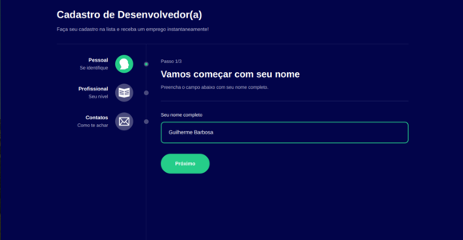

<h1 align='center'>Mult Step Form</h1>

<p align="center">
  <a href="#-sobre">Sobre</a>&nbsp;&nbsp;&nbsp;|&nbsp;&nbsp;&nbsp;
  <a href="#-layout">Layout</a>&nbsp;&nbsp;&nbsp;|&nbsp;&nbsp;&nbsp;
  <a href="#-tecnologias-e-ferramentas">Tecnologias e Ferramentas</a>&nbsp;&nbsp;&nbsp;|&nbsp;&nbsp;&nbsp;
  <a href="#-funcionalidades">Funcionalidades</a>&nbsp;&nbsp;&nbsp;|&nbsp;&nbsp;&nbsp;
  <a href="#-instalação">Instalação</a>&nbsp;&nbsp;&nbsp;|&nbsp;&nbsp;&nbsp;
  <a href="#-licença">Licença</a>&nbsp;&nbsp;&nbsp;|&nbsp;&nbsp;&nbsp;
</p>

<p align="center">
    ✔ Projeto concluído
</p>

<hr/>


## ❓ Sobre

Este projeto é uma aplicação ReactJS que consiste em um formulário multi-etapas. O projeto serve para fins didáticos e foi feito baseado em um [tutorial](https://www.youtube.com/watch?v=W1Ed9TEMGJU&list=PL_kvSTSEFm2CwHCtvTk0llGDvM0L2jx3O&index=6) do Youtube do canal [Boniek Lacerda](https://www.youtube.com/@bonieky) porém com algumas modificações. 


## 🎨 Layout

 


## 🛠 Tecnologias e Ferramentas

- [ReactJS](https://pt-br.reactjs.org/)
- [TypeScript](https://www.typescriptlang.org/)
- [Styled Components](https://styled-components.com/)
- [React Router](https://reactrouter.com/en/main)
- [Vite](https://vitejs.dev/)
- [Vite Plugin SVGR](https://www.npmjs.com/package/vite-plugin-svgr)

Veja como ficou o arquivo [package.json](./package.json) 


## ⚙ Funcionalidades 

- [x] Permitir ao usuário digitar dados como nome, e-mail, url de seu perfil do Github, e nível de experiência em programação 
- [x] Mostrar ao fim das etapas do formulário os dados do usuário
- [x] Salvar dados do usuário e etapas do formulário no estado da aplicação 
- [x] Compartilhar dados entre componentes da árvore usando contexto 
- [x] Permitir gerenciamento de páginas da aplicação usando React Router DOM 


## 💻 Instalação 

Para abrir e executar o projeto no seu computador, você vai precisar ter o [Node.js](https://nodejs.org/en) instalado na sua máquina (recomendo baixar a versão LTS). Além disso, para conseguir executar os comandos de terminal a seguir, você precisará instalar o [GIT](https://git-scm.com/). 
É recomendado ter alguns conhecimentos básicos de HTML, CSS, JavaScript e ReactJS para conseguir entender os códigos do projeto e também ter alguma noção prévia de comandos de terminal para conseguir acompanhar as instruções no seu computador. 
Após ter certeza de que tudo está instalado no seu computador, acompanhe os passos a seguir: 


1. Faça download do projeto ou clone ele com o seguinte comando no terminal: 

```bash 
    git clone https://github.com/Gustavo-Victor/mult-step-form.git
```
 
2. Descompacte o arquivo do projeto e abra a pasta do projeto; se tiver clonado basta só abrir a pasta do projeto; você pode abrir a pasta usando o seguinte comando: 

```bash 
    cd photo-gallery/
```

3. Instale as dependências necessárias do projeto (a pasta do projeto precisa estar aberta no terminal): 

```bash 
    npm i -g yarn ;
    yarn install ; 
```


4. Execute o projeto em modo de desenvolvimento: 

```bash 
    yarn dev 
```

7. Abra o projeto em seu navegador de preferência. (Basta digitar na barra de pesquisa: http://localhost:5173/). 


<hr/>

## 📝 Licença 

O projeto está sob a Licensa MIT 

Qualquer pessoa pode usar, clonar e contribuir com este projeto. 

Clique [aqui](./LICENSE) para saber mais  


